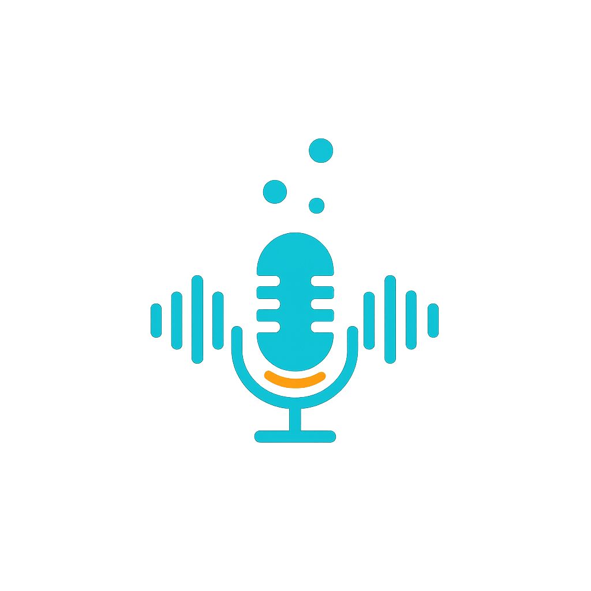

<h1 align="center">
  
  <br>
  Speak Lab
</h1>
Practice English speaking in your browser — JAM, tongue twisters, impromptu speeches, and interview questions. Records straight to **`.m4a`** (Safari/iOS) or **`.mp3`** (everyone else) — no `.webm`, no server, no account.

## Features

- **5 practice modes**: JAM (60s), Tongue Twisters (easy/medium/hard), Impromptu speeches by category, Interview questions (customer service, ownership, STAR, tech roles, etc.), and **Free** (your own custom prompt).
- **In-browser recorder** with built-in MP3 encoder (`lamejs`) so files are universally playable.
- **Save to folder** via the File System Access API (Chrome/Edge desktop) — recordings drop straight into your Obsidian vault. Other browsers download instead.
- **Mobile-friendly** dark theme.
- **Pure static site** — no backend, no build step.

## Run it

### Locally
```bash
python3 start-recorder-local.py
# opens http://127.0.0.1:8000/ and validates project files

# options
python3 start-recorder-local.py --find-port    # if port 8000 is busy
python3 start-recorder-local.py -p 8765          # custom port
python3 start-recorder-local.py --host 0.0.0.0   # LAN access (UI testing)
python3 start-recorder-local.py --no-open        # don't launch browser
```

Any static server also works, e.g. `python3 -m http.server 8000`.
> The microphone requires a **secure context** (`https://` or `http://localhost`/`127.0.0.1`). Opening `index.html` directly with `file://` will not work — browsers block mic access.

### Deploy
Drop the repo on any static host:
- **GitHub Pages** — Settings → Pages → Deploy from `main` branch, root.
- **Cloudflare Pages / Netlify / Vercel** — no build command, output directory `/`.

## Project structure

```
speak-lab/
├── start-recorder-local.py     # local dev server (mic-safe localhost)
├── index.html                  # markup + module entry point
├── src/
│   ├── styles.css              # all CSS (dark theme)
│   ├── app.js                  # loads data, wires tabs + shuffle
│   ├── recorder.js             # mic capture + MP3 encoding
│   ├── vault.js                # File System Access API + IndexedDB handle
│   ├── util.js                 # timestamps, slug, toast, downloadBlob
│   └── data/
│       ├── jam.json            # 300+ JAM prompts
│       ├── tongue-twisters.json # easy / medium / hard
│       ├── impromptu.json      # 6 categories
│       └── interview.json      # 6 categories incl. customer service, STAR
└── README.md
```

## Customize prompts

Edit any file in `src/data/`. The schemas:
- `jam.json` — `string[]`
- `tongue-twisters.json` — `{ easy: {text, focus}[], medium: ..., hard: ... }`
- `impromptu.json` / `interview.json` — `{ category: string, questions: string[] }[]`

Reload the page after editing — that's it.

## Where recordings go

Filenames: `{module}_{YYYY-MM-DD_HH-MM-SS}_{prompt-slug}.{m4a|mp3}`

If you "Pick vault folder" (Chrome/Edge desktop), they save into the matching subfolder:
- `07-Attachments/Audio/Recordings/JAM-Recordings/`
- `07-Attachments/Audio/Recordings/Tongue-Twisters-Recordings/`
- `07-Attachments/Audio/Recordings/Impromptu-Recordings/`
- `07-Attachments/Audio/Recordings/Interview-Recordings/`

On Safari, Firefox, Android, or iOS the **Save** button downloads instead — move the file into the matching folder manually. Change these paths in `src/app.js` → `PATHS`.

## Browser support

| Browser | Mic | Native format | MP3 output | Save to folder |
|---|---|---|---|---|
| Chrome / Edge (desktop) | ✅ | webm/opus | ✅ encoded | ✅ |
| Safari (macOS/iOS) | ✅ | mp4/aac | ✅ `.m4a` native | ❌ download |
| Firefox | ✅ | webm/opus | ✅ encoded | ❌ download |
| Brave | ✅* | webm/opus | ✅ encoded | ✅ |

*Brave: lower Shields for the site and allow Microphone.

## License

MIT
